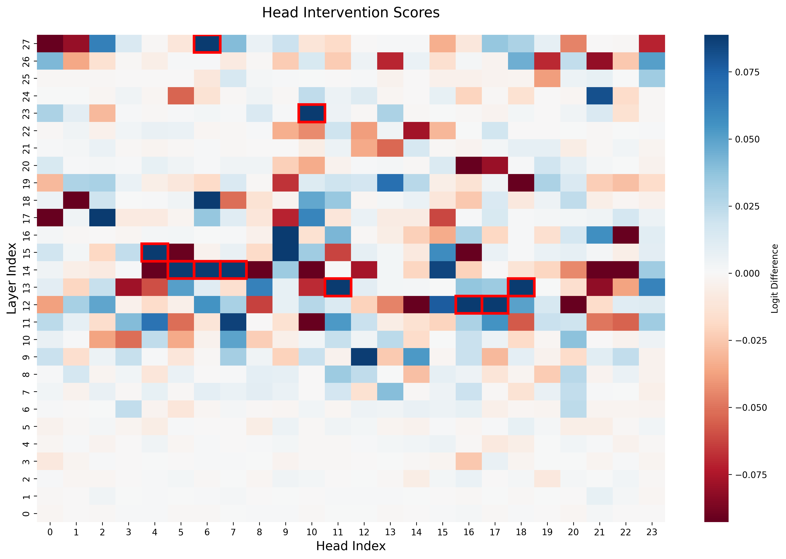
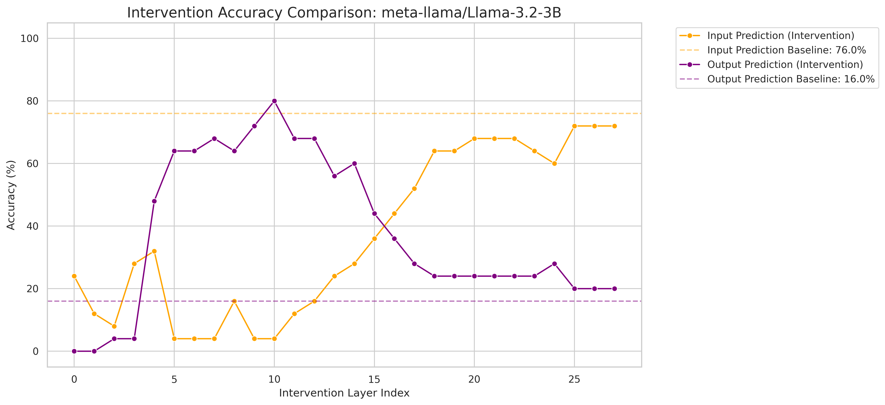
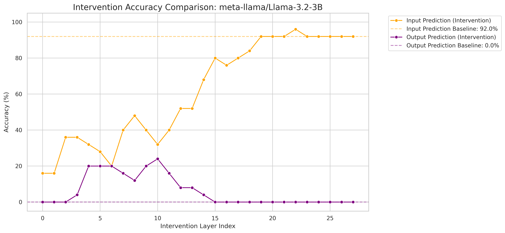
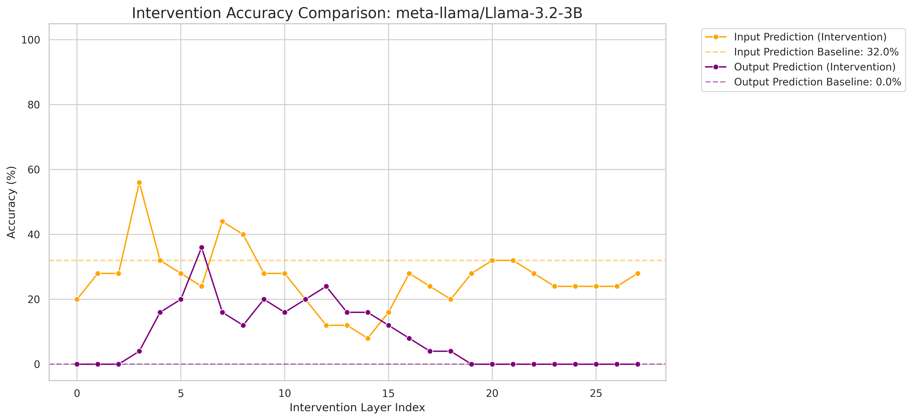

# Zero-Shot Inference Mechanism

Exploring how large language models perform zero-shot relational reasoning internally, using activation patching and intervention vectors.

## Motivation

When prompted with a relation like "antonym" and an input word, LLMs can produce the correct output (e.g., "hot" → "cold") without any in-context examples. **How does this zero-shot reasoning happen inside the model?**

This project investigates that question by:
1. Identifying which attention heads encode relational knowledge via activation patching
2. Extracting an "intervention vector" that captures the relation's internal representation
3. Injecting the vector at different layers to test whether it can steer model behavior

## Method

The pipeline runs on **Llama-3.2-3B** with the antonym relation as the primary case study.

### Step 1 — Baseline Evaluation
Evaluate the model on three relation conditions (`antonym`, `none`, `repeat`) to establish baseline accuracy and identify correct/incorrect samples.

### Step 2 — Activation Patching
For correctly predicted samples, cache attention head outputs and compute per-head intervention scores by measuring how each head's mean activation shifts the output logit toward the target.



### Step 3 — Intervention Vector Construction
Select top-scoring heads and project their mean activations through each head's output projection, then sum them into a single intervention vector.

### Step 4 — Layer-wise Intervention
Add the intervention vector to hidden states at each layer and measure accuracy changes across three conditions:

**Correct samples (antonym → none)** — Can the vector maintain antonym behavior even when the prompt says "none"?



**Incorrect samples (antonym → none)** — Can the vector restore correct behavior on samples the model originally got wrong?



**Incorrect samples (no relation change)** — What happens when we intervene without changing the relation prompt?



## Project Structure

```
├── demo.ipynb                  # Main experiment notebook
├── dataset/
│   └── antonym.json            # Antonym word pairs
├── src/
│   ├── evaluation_helpers.py   # Model loading, inference, evaluation pipeline
│   ├── patching_helpers.py     # Activation caching, head scoring, vector construction
│   ├── intervention_helpers.py # Layer-wise intervention and evaluation
│   ├── visualization_helpers.py# All plotting utilities
│   └── io_helpers.py           # File I/O (JSON, CSV, PyTorch)
└── results/                    # Generated outputs (CSVs, figures, tensors)
```

## Getting Started

### Prerequisites

- Python 3.10+
- GPU recommended (tested on NVIDIA L4 via Colab)
- HuggingFace account with access to [meta-llama/Llama-3.2-3B](https://huggingface.co/meta-llama/Llama-3.2-3B)

### Setup

```bash
pip install torch transformers nnsight pandas matplotlib seaborn numpy tqdm
huggingface-cli login
```

### Run

Open `demo.ipynb` and run all cells sequentially. The notebook handles the full pipeline from model loading through intervention analysis.

## Built With

- [nnsight](https://github.com/ndif-team/nnsight) — Interpretability-first model tracing and intervention
- [transformers](https://github.com/huggingface/transformers) — Model and tokenizer loading

## License

This project is licensed under the MIT License. See [LICENSE](LICENSE) for details.
